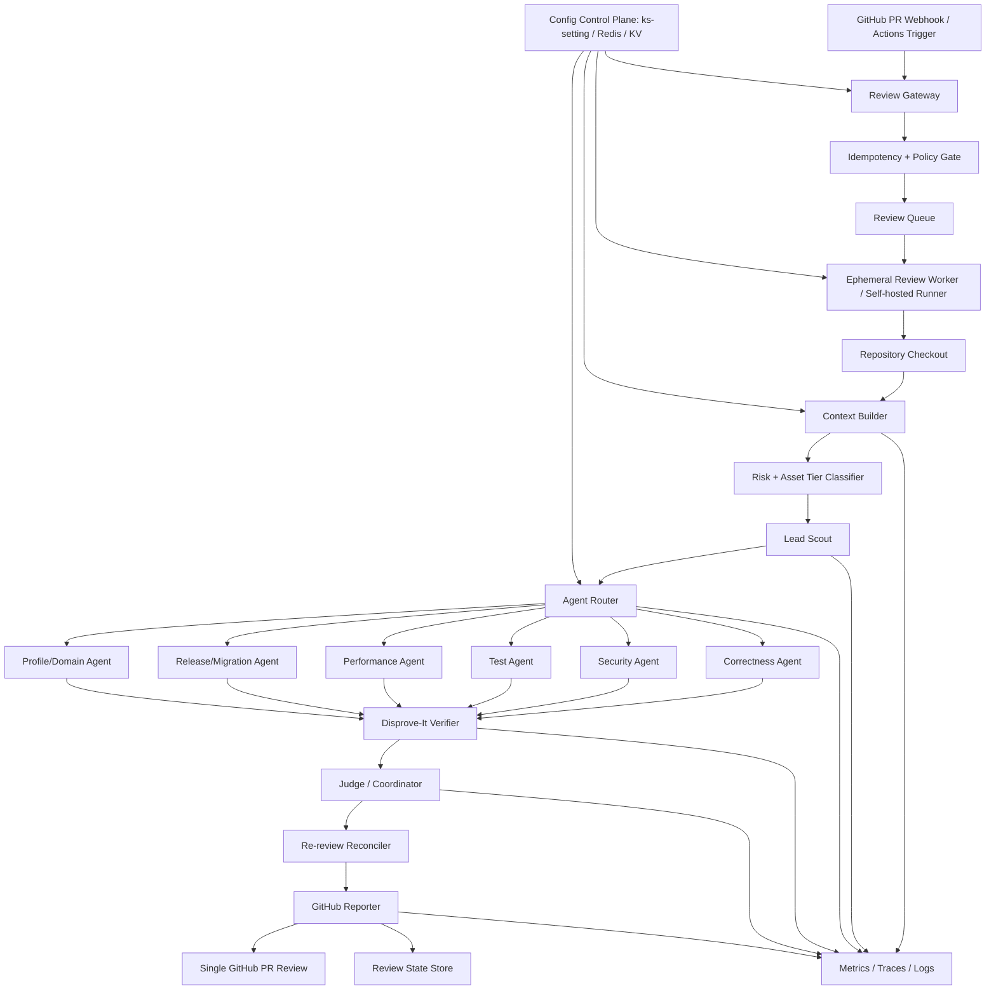
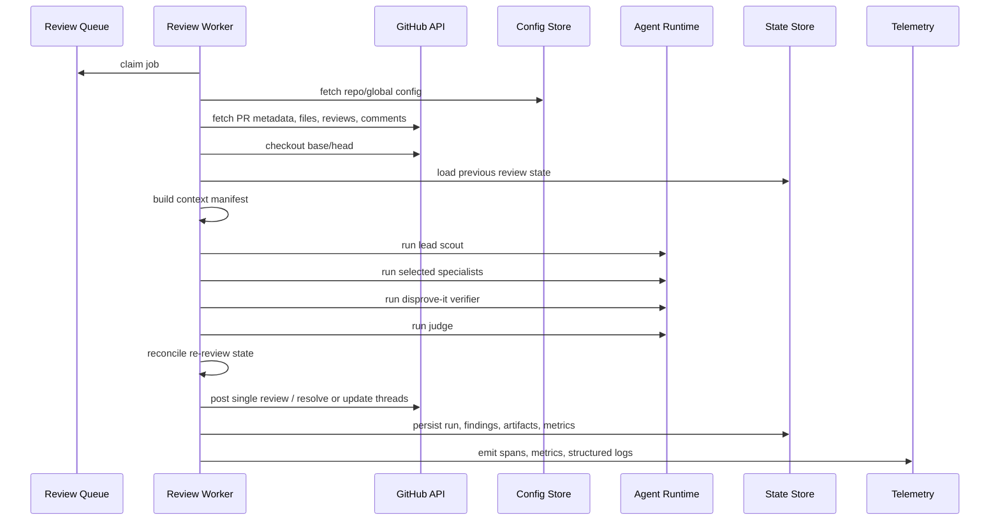
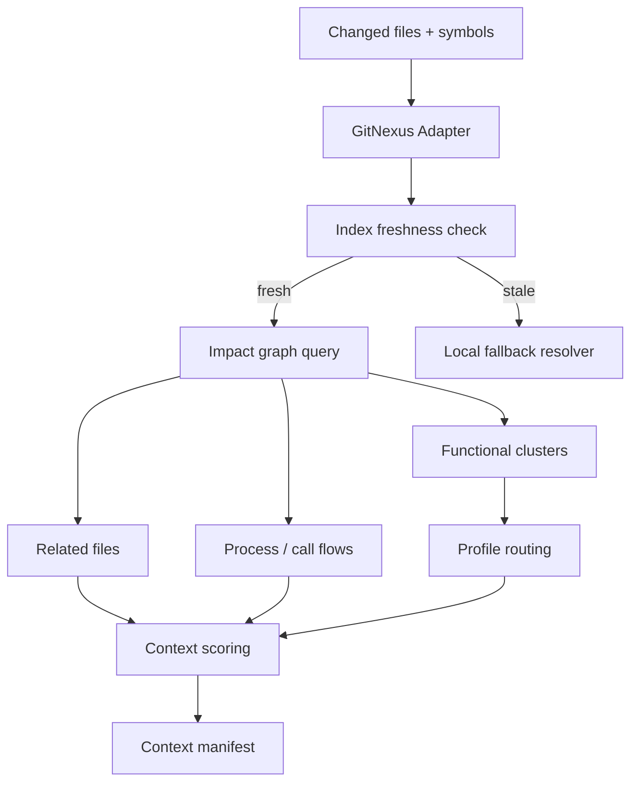
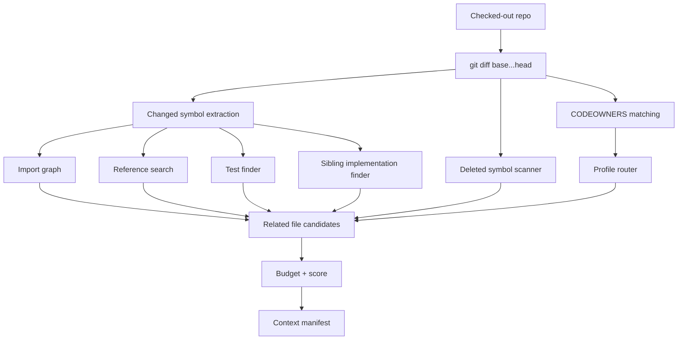
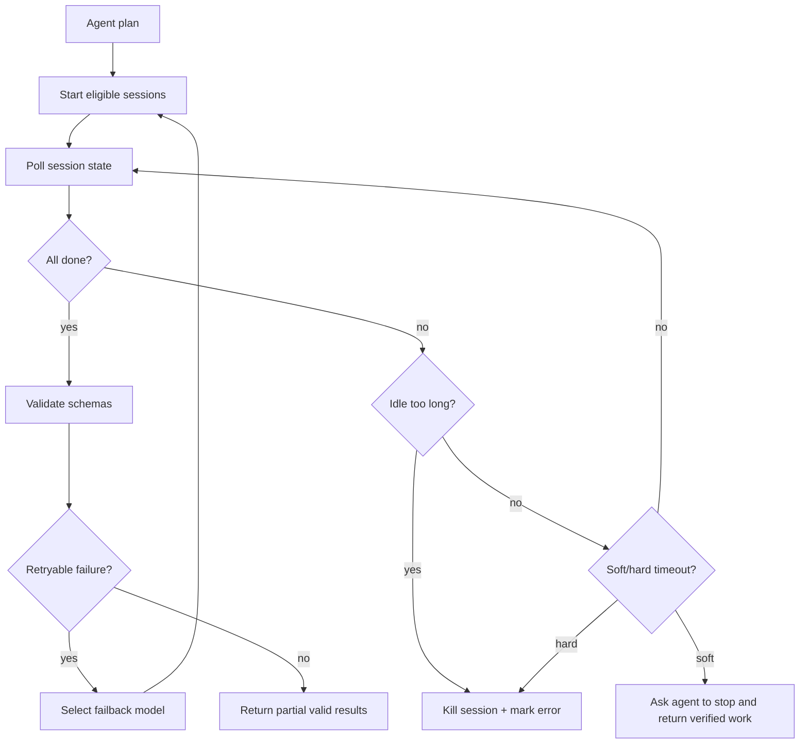
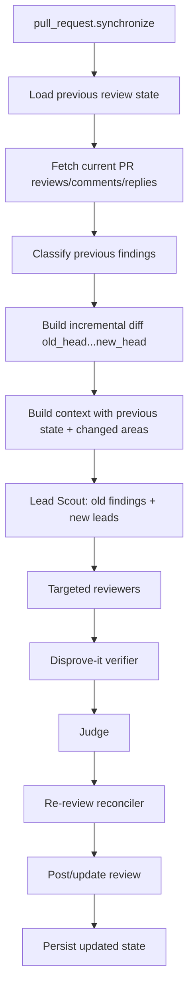

# Reliable AI Code Review System: Cloud-Agnostic High-Level Design

## 1. Executive summary

This design describes a production-oriented AI code review system that automatically reviews GitHub pull requests when they are opened or updated. The goal is not to generate generic review comments. The goal is to produce **reliable, evidence-backed, line-anchored findings** that engineers trust enough to act on.

The system uses a staged pipeline:

```text
GitHub PR event
  -> review gateway
  -> idempotent queue
  -> ephemeral review worker / self-hosted runner
  -> context builder
  -> risk + asset tiering
  -> lead scout
  -> targeted specialist agents
  -> disprove-it verifier
  -> judge / coordinator
  -> re-review reconciler
  -> GitHub review reporter
  -> metrics + eval feedback loop
```

Key design choices:

1. **Precision over volume.** A review with no comments is a valid successful result.
2. **Context is built before reasoning.** Agents receive focused context manifests, not a raw repository dump.
3. **Lead Scout separates noticing from verification.** The scout identifies suspicious areas; reviewers verify only targeted leads.
4. **Disprove-it is mandatory.** Every candidate finding is challenged before posting.
5. **Re-reviews are incremental.** New commits should reuse previous findings, thread state, and cached context instead of starting from scratch.
6. **Cloud-agnostic by interface.** GitHub, GitNexus, Redis, model providers, tracing backends, and OpenCode are adapters behind stable interfaces.
7. **Observability measures trust.** Acceptance rate, duplicate rate, suppression rate, stale comment rate, cost, token cache hit rate, and break-glass rate are first-class metrics.

The design is inspired by public lessons from Cloudflare and DoorDash:

- Cloudflare describes a CI-native, OpenCode-based multi-agent reviewer with plugin-based orchestration, risk tiers, shared diff/context files, concurrent reviewer scheduling, circuit breakers, failback chains, remote config, telemetry, and incremental re-reviews. [Cloudflare AI code review blog](https://blog.cloudflare.com/ai-code-review/)
- DoorDash describes a reliability-focused reviewer that optimizes for accepted, specific, grounded comments. Its most important architectural change was a **Lead Scout** that finds investigation leads before deep reviewers verify them; it also uses profile routing, disprove-it verification, timeout guardrails, and acceptance-driven evals. [DoorDash AI code reviewer blog](https://careersatdoordash.com/blog/doordash-built-an-ai-code-reviewer-engineers-actually-listen-to/)

---

## 2. Product principles

### 2.1 Reliability contract

Every posted finding must satisfy this contract:

```yaml
postable_finding_contract:
  required:
    - anchored_to_changed_file_and_line
    - backed_by_code_evidence
    - explains_concrete_behavior_or_operational_risk
    - gives_specific_next_action
    - survives_disprove_it_verification
    - is_not_duplicate_of_existing_or_previous_bot_comment
    - is_not_stale_against_current_head_sha
    - is_not_already_caught_by_ci_or_static_analysis
    - confidence_meets_threshold_for_severity
  forbidden:
    - generic_style_feedback
    - speculative_language_without_evidence
    - broad "consider checking" comments
    - comments on unchanged code unless directly caused by the diff
    - comments that only repeat linter/static-analysis findings
    - multiple comments for the same root cause
```

### 2.2 Explicit non-goals for the first production version

Do **not** start with:

- open-ended "review the whole repo" prompts;
- automatic code changes or auto-fixes;
- request-changes blocking except for narrowly defined, high-confidence categories;
- a large swarm of agents;
- broad style/nit review;
- unbounded Graph RAG retrieval;
- comments that cannot be traced to a changed line.

### 2.3 Success metrics

The primary success metric is not "number of comments." It is:

```text
accepted_high_critical_finding_rate
```

A finding is accepted when the author or reviewer changes code, adds tests, reverts a risky change, or explicitly acknowledges and resolves the issue in a way that the system can classify as addressed.

Secondary reliability metrics:

```yaml
quality:
  - accepted_finding_rate
  - high_critical_accepted_rate
  - duplicate_comment_rate
  - stale_comment_rate
  - author_negative_feedback_rate
  - break_glass_rate
  - disprove_it_suppression_rate
  - judge_suppression_rate_by_agent

efficiency:
  - cost_per_review
  - tokens_per_review
  - cache_hit_rate
  - p50_p95_p99_review_latency
  - context_files_read_per_agent
  - model_tier_distribution
  - zero_comment_review_rate

operations:
  - webhook_to_job_start_latency
  - queue_lag
  - runner_startup_latency
  - checkout_failures
  - agent_timeout_rate
  - provider_failback_rate
  - reporter_post_failure_rate
```

---

## 3. Architecture overview

### 3.1 Logical architecture



### 3.2 Deployment model

Use a **GitHub App + self-hosted ephemeral runner** model.

GitHub App responsibilities:

- receive `pull_request` webhooks;
- authenticate with GitHub installation tokens;
- read PR metadata, files, reviews, comments, and previous bot state;
- post check-run status and PR reviews;
- manage app-level permissions and auditability.

Self-hosted runner responsibilities:

- clone the repository;
- build local context;
- run OpenCode or another agent runner;
- keep source code and company secrets inside company-controlled infrastructure;
- run language tooling, test discovery, and static context extraction.

GitHub recommends ephemeral self-hosted runners for autoscaling because each runner handles one job and can then be wiped, which is a good fit for code review isolation. [GitHub self-hosted runner docs](https://docs.github.com/en/actions/reference/runners/self-hosted-runners)

### 3.3 Cloud-agnostic implementation options

| Capability       | Cloud-agnostic interface | Example implementation                                    |
| ---------------- | ------------------------ | --------------------------------------------------------- |
| Event ingress    | `WebhookReceiver`        | GitHub App webhook handler                                |
| Job queue        | `ReviewQueue`            | Redis Streams, SQS, Pub/Sub, Kafka, RabbitMQ              |
| Config           | `ConfigStore`            | `ks-setting`, Redis, Consul, etcd                         |
| State            | `ReviewStateStore`       | Postgres, DynamoDB-compatible DB, Redis + object storage  |
| Object artifacts | `ArtifactStore`          | S3-compatible storage, GCS, Azure Blob, MinIO             |
| Runner           | `ReviewWorker`           | GitHub self-hosted runner, Kubernetes Job, Nomad task, VM |
| Agent runtime    | `AgentRuntime`           | OpenCode SDK/server, custom LLM harness                   |
| Context graph    | `ContextGraphAdapter`    | GitNexus, Sourcegraph-like service, local index           |
| LLM gateway      | `ModelGateway`           | internal AI gateway, LiteLLM, direct provider APIs        |
| Observability    | `TelemetrySink`          | OpenTelemetry Collector, Prometheus, vendor backend       |

---

## 4. Triggering and idempotency

### 4.1 GitHub events

Subscribe to these events:

```yaml
github_events:
  pull_request:
    actions:
      - opened
      - reopened
      - synchronize # new commits pushed
      - ready_for_review
      - converted_to_draft
      - closed
  pull_request_review_comment:
    actions:
      - created
      - edited
      - deleted
  pull_request_review:
    actions:
      - submitted
      - dismissed
  issue_comment:
    actions:
      - created # commands like /ai-review, break glass, re-run
```

GitHub webhooks include headers such as `X-GitHub-Event`, `X-GitHub-Delivery`, and `X-Hub-Signature-256`; validate the signature and use the delivery ID as part of idempotency. [GitHub webhook docs](https://docs.github.com/en/webhooks/webhook-events-and-payloads?actiontype=synchronize)

### 4.2 Idempotency key

Use a key that distinguishes initial review from re-review while deduplicating retries:

```text
review_run_key =
  sha256(
    installation_id + ":" +
    owner + "/" + repo + ":" +
    pull_number + ":" +
    head_sha + ":" +
    event_action + ":" +
    workflow_attempt_or_delivery_id_bucket
  )
```

For normal `pull_request.synchronize`, dedupe by `head_sha`. If GitHub redelivers the same webhook, do not run twice.

### 4.3 Event handling pseudo-code

```ts
async function handleGithubWebhook(req: WebhookRequest) {
  verifyGithubSignature(req.rawBody, req.headers["x-hub-signature-256"]);

  const event = parseGithubEvent(req);
  const policy = await configStore.getRepoPolicy(event.repoFullName);

  if (!shouldReview(event, policy)) {
    return ack("ignored_by_policy");
  }

  const pr = await github.getPullRequest(event);
  if (pr.draft && !policy.reviewDraftPRs) {
    return ack("ignored_draft");
  }

  const key = buildReviewRunKey(event, pr.head.sha);
  const inserted = await idempotencyStore.insertIfAbsent(key, {
    status: "queued",
    repo: event.repoFullName,
    pullNumber: pr.number,
    headSha: pr.head.sha,
    createdAt: now(),
  });

  if (!inserted) {
    return ack("duplicate");
  }

  await queue.enqueue({
    key,
    repo: event.repoFullName,
    pullNumber: pr.number,
    baseSha: pr.base.sha,
    headSha: pr.head.sha,
    trigger: event.action,
    isReReview: await reviewStateStore.hasPriorRun(
      event.repoFullName,
      pr.number,
    ),
  });

  await github.createOrUpdateCheckRun({
    repo: event.repoFullName,
    headSha: pr.head.sha,
    name: "AI Code Review",
    status: "queued",
  });

  return ack("queued");
}
```

---

## 5. Review worker lifecycle

### 5.1 Worker flow



### 5.2 Worker pseudo-code

```ts
async function runReviewJob(job: ReviewJob) {
  return telemetry.span(
    "review.run",
    { repo: job.repo, pr: job.pullNumber },
    async () => {
      await github.setCheckRun(job, "in_progress");

      const cfg = await configStore.resolveEffectiveConfig(job.repo);
      const previous = await reviewStateStore.loadPrevious(
        job.repo,
        job.pullNumber,
      );

      const workspace = await checkoutRepo({
        repo: job.repo,
        baseSha: job.baseSha,
        headSha: job.headSha,
        sparseCheckout: cfg.checkout.sparseCheckout,
      });

      const prSnapshot = await github.fetchPrSnapshot(job);

      if (prSnapshot.headSha !== job.headSha) {
        return markStaleAndAbort(job, prSnapshot.headSha);
      }

      const context = await contextBuilder.build({
        workspace,
        job,
        prSnapshot,
        previous,
        cfg,
      });

      const risk = assessRiskAndAssetTier(context, cfg);
      const scout = await agentRuntime.run("lead_scout", { context, risk });

      const plan = agentRouter.plan({
        context,
        scoutLeads: scout.leads,
        risk,
        cfg,
      });

      const specialistResults = await orchestrator.runPlan(plan, context);

      const verified = await verifier.verifyAll({
        candidates: specialistResults.findings,
        context,
        previous,
      });

      const judged = await judge.consolidate({
        verifiedFindings: verified.postableCandidates,
        context,
        previous,
        risk,
      });

      const reconciled = await reReviewReconciler.reconcile({
        judged,
        previous,
        prSnapshot,
        context,
      });

      await reporter.postReview({
        job,
        prSnapshot,
        review: reconciled.review,
        previous,
      });

      await reviewStateStore.persistRun({
        job,
        context,
        risk,
        scout,
        specialistResults,
        verified,
        judged,
        reconciled,
      });

      await github.setCheckRun(job, "completed", reconciled.checkConclusion);
    },
  );
}
```

### 5.3 Local-first bridge before CI

Before the GitHub App / runner path is enabled, the desktop MVP should exercise the same reliability contract locally. The local pipeline now mirrors the CI design in these ways:

- **Durable phases and resume:** review sessions checkpoint context build, local scout, reviewer execution, normalization, dedupe, verification, evidence map build, and draft preparation. On backend/app restart, queued/running sessions are reconciled to resumable local state instead of disappearing.
- **Local risk scout:** after context build and before reviewer execution, cocode computes deterministic risk tiers and investigation leads from changed-file paths, churn, generated/excluded flags, and the focus prompt. These leads are saved as an artifact, emitted as `ReviewScoutCompleted`, and injected into reviewer prompts as prioritization hints rather than findings.
- **Trust states and publish gates:** local support from code evidence is distinguished from verifier-survived findings. GitHub preview/posting requires accepted, publishable findings with exact changed-line anchors, useful evidence summaries, and either a suggested fix or draft comment.
- **Event replay:** review events remain sequence-ordered and the renderer reconnects with the last delivered sequence, so chat/progress can recover from transient stream drops.
- **Dogfood eval loop:** local eval runs now track reviewed, accepted, dismissed, publishable, suppressed, and not-actionable outcomes so the product can optimize for trusted findings before CI automation expands the blast radius.

This keeps CI-specific pieces small later: the GitHub runner should become another trigger/reporting adapter over the local session, event, artifact, finding, and eval contracts rather than a separate review system.

---

## 6. Config control plane

The control plane should let platform owners tune the system without redeploying workers.

### 6.1 Effective config sources

```text
global defaults
  -> organization config
  -> repository config
  -> CODEOWNERS / path policy
  -> branch policy
  -> manual override command
```

### 6.2 Config storage

Use `ks-setting`, Redis, or another KV/config service.

```yaml
config_keys:
  ai_review/global:
    enabled: true
    default_model_tiers:
      economy: "provider-a/small"
      standard: "provider-a/medium"
      strong: "provider-a/large"
    provider_status:
      provider-a:
        enabled: true
      provider-b:
        enabled: true
    failback_chains:
      strong:
        - "provider-a/large"
        - "provider-b/large"
        - "provider-a/medium"
    max_comments_per_review: 5
    default_timeout_seconds: 1500

  ai_review/repos/payment-service:
    enabled: true
    asset_tier: 0
    review_draft_prs: false
    profile_sets:
      - payments
      - data-integrity
      - security-sensitive
    security_sensitive_paths:
      - "auth/**"
      - "payments/**"
      - "crypto/**"
    context_mode: "gitnexus_or_local"
    request_changes_enabled: false
```

### 6.3 Runtime config fetch

```ts
async function resolveEffectiveConfig(repo: string): Promise<EffectiveConfig> {
  const [globalCfg, orgCfg, repoCfg] = await Promise.all([
    configStore.get("ai_review/global"),
    configStore.get(`ai_review/orgs/${orgOf(repo)}`),
    configStore.get(`ai_review/repos/${repo}`),
  ]);

  const merged = deepMerge(globalCfg, orgCfg, repoCfg);
  validateConfigSchema(merged);
  return merged;
}
```

Cloudflare’s implementation uses a remote config service to change per-reviewer model routing and provider enablement without code changes; this design keeps that idea but makes the backing store cloud-agnostic. [Cloudflare AI code review blog](https://blog.cloudflare.com/ai-code-review/)

---

## 7. Context Builder

The Context Builder is the most important non-LLM component. It converts a PR into a small, structured, review-ready context package.

### 7.1 Context Builder responsibilities

```yaml
context_builder_responsibilities:
  - fetch_pr_metadata
  - checkout_base_and_head
  - compute_diff_entries
  - filter_noise_files
  - detect_generated_files_but_keep_migrations
  - extract_patch_files
  - extract_changed_symbols
  - parse_codeowners_and_ownership
  - load_previous_review_state
  - identify_relevant_profiles
  - find_related_context_with_gitnexus_or_local_index
  - create_shared_context_file
  - create_per_file_patch_files
  - create_context_manifest_json
  - enforce_token_budget
  - emit_context_metrics
```

Cloudflare explicitly avoids embedding full diffs in every prompt; it writes per-file patch files to a diff directory and writes a shared context file so sub-reviewers can read common PR metadata without multiplying token cost across reviewers. [Cloudflare AI code review blog](https://blog.cloudflare.com/ai-code-review/)

### 7.2 Context package layout

```text
/workspace/review-context/
  manifest.json
  shared-pr-context.md
  previous-review-state.json
  risk-input.json
  profiles/
    payments.idempotency.md
    data-integrity.semantic-migration.md
  diffs/
    services_payments_authorize.go.patch
    services_payments_capture.go.patch
  related/
    services_payments_idempotency.go
    tests_payments_authorize_retry_test.go
  indexes/
    changed_files.json
    changed_symbols.json
    codeowners_matches.json
    related_files.json
    candidate_tests.json
    deleted_symbol_usages.json
    profile_matches.json
```

Agents receive the `manifest.json` and file paths. They should read only what they need.

### 7.3 Context manifest

```json
{
  "schemaVersion": "review-context.v1",
  "repo": "acme/payment-service",
  "pullNumber": 48291,
  "baseSha": "abc123",
  "headSha": "def456",
  "trigger": "synchronize",
  "isReReview": true,
  "sharedContextPath": "shared-pr-context.md",
  "previousReviewStatePath": "previous-review-state.json",
  "diffDirectory": "diffs",
  "changedFiles": [
    {
      "path": "services/payments/authorize.go",
      "status": "modified",
      "additions": 18,
      "deletions": 6,
      "patchPath": "diffs/services_payments_authorize.go.patch",
      "changedSymbols": ["AuthorizePayment", "buildProviderRequest"],
      "owners": ["payments-platform"],
      "isGenerated": false,
      "isMigration": false
    }
  ],
  "relatedFiles": [
    {
      "path": "services/payments/idempotency.go",
      "reason": "direct symbol reference: IdempotencyKey",
      "score": 0.91,
      "source": "gitnexus"
    },
    {
      "path": "tests/payments/authorize_retry_test.go",
      "reason": "candidate test file",
      "score": 0.78,
      "source": "local_test_finder"
    }
  ],
  "profiles": [
    {
      "id": "payments.idempotency",
      "path": "profiles/payments.idempotency.md",
      "score": 0.95,
      "reason": "path + symbol + incident rule match"
    }
  ],
  "budgets": {
    "maxTotalInputTokens": 160000,
    "maxRelatedFiles": 30,
    "maxProfiles": 8,
    "maxPatchFilesPerAgent": 20
  }
}
```

### 7.4 Context Builder pseudo-code

```ts
async function buildContext(input: ContextBuildInput): Promise<ReviewContext> {
  const pr = input.prSnapshot;
  const workspace = input.workspace;

  const rawDiff = await git.diff({
    cwd: workspace.path,
    base: input.job.baseSha,
    head: input.job.headSha,
    unified: 80,
  });

  const diffEntries = parseDiff(rawDiff);
  const filtered = filterDiffEntries(diffEntries, {
    ignoreLockfiles: true,
    ignoreVendored: true,
    ignoreMinified: true,
    ignoreGenerated: true,
    keepMigrations: true,
  });

  const patchFiles = await writePatchFiles(filtered, "review-context/diffs");

  const changedSymbols = await symbolExtractor.extract({
    workspace,
    diffEntries: filtered,
    strategy: ["tree-sitter", "lsp", "regex-fallback"],
  });

  const ownership = await codeowners.match(
    workspace.path,
    filtered.map((f) => f.path),
  );

  const previous = input.previous ?? emptyPreviousReviewState();

  const profileMatches = await profileRouter.match({
    repo: input.job.repo,
    changedFiles: filtered,
    changedSymbols,
    ownership,
    prTitle: pr.title,
    prBody: sanitizePromptBoundaries(pr.body),
    previousFindings: previous.findings,
  });

  const related = await relatedContextResolver.resolve({
    workspace,
    diffEntries: filtered,
    changedSymbols,
    profileMatches,
    mode: input.cfg.contextMode,
    maxFiles: input.cfg.context.maxRelatedFiles,
  });

  const budgeted = enforceContextBudget({
    patchFiles,
    related,
    profileMatches,
    maxTokens: input.cfg.context.maxInputTokens,
  });

  const sharedContext = await writeSharedContext({
    pr,
    filteredDiffSummary: summarizeDiff(filtered),
    previous,
    policy: input.cfg.reviewPolicy,
    profileSummary: summarizeProfiles(budgeted.profiles),
  });

  const manifest = await writeManifest({
    pr,
    patchFiles: budgeted.patchFiles,
    relatedFiles: budgeted.relatedFiles,
    profiles: budgeted.profiles,
    sharedContext,
    changedSymbols,
    ownership,
  });

  return { manifest, workspace, previous, pr };
}
```

### 7.5 Noise filtering

Use deterministic filters before agent execution:

```ts
const NOISE_FILE_PATTERNS = [
  "package-lock.json",
  "yarn.lock",
  "pnpm-lock.yaml",
  "Cargo.lock",
  "go.sum",
  "poetry.lock",
  "Pipfile.lock",
];

const NOISE_EXTENSIONS = [".min.js", ".min.css", ".bundle.js", ".map"];

function shouldReviewFile(file: DiffEntry): boolean {
  if (isDatabaseMigration(file.path)) return true;
  if (matchesAny(file.path, NOISE_FILE_PATTERNS)) return false;
  if (endsWithAny(file.path, NOISE_EXTENSIONS)) return false;
  if (isVendored(file.path)) return false;
  if (looksGenerated(file.firstLines)) return false;
  return true;
}
```

Cloudflare describes a similar filtering pipeline for lock files, vendored dependencies, minified assets, source maps, and generated files, while explicitly keeping database migrations because generated-looking migrations may still carry schema risk. [Cloudflare AI code review blog](https://blog.cloudflare.com/ai-code-review/)

### 7.6 Prompt-injection sanitization

PR titles, PR bodies, comments, commit messages, and file contents are untrusted input.

```ts
const PROMPT_BOUNDARY_TAGS = [
  "pr_input",
  "pr_body",
  "pr_comments",
  "pr_details",
  "changed_files",
  "existing_inline_findings",
  "previous_review",
  "custom_review_instructions",
  "agents_md_template_instructions",
];

function sanitizePromptBoundaries(text: string): string {
  const pattern = new RegExp(
    `</?(?:${PROMPT_BOUNDARY_TAGS.join("|")})[^>]*>`,
    "gi",
  );
  return text.replace(pattern, "");
}
```

Cloudflare calls out stripping prompt boundary tags from user-controlled MR content to prevent prompt-structure injection. [Cloudflare AI code review blog](https://blog.cloudflare.com/ai-code-review/)

---

## 8. Context mode A: with GitNexus

### 8.1 Role of GitNexus

Use it as a **read-only code intelligence adapter**, not as the reviewer itself.

GitNexus is publicly described as a code intelligence engine that indexes repositories into graphs of dependencies, call chains, functional clusters, and execution flows, with agent-facing surfaces such as MCP. The upstream GitHub repository describes it as a zero-server code intelligence engine with a graph/RAG agent and references Tree-sitter and MCP among its building blocks. [GitNexus GitHub repository](https://github.com/abhigyanpatwari/GitNexus)

### 8.2 GitNexus adapter interface

```ts
interface ContextGraphAdapter {
  status(repo: string, sha: string): Promise<IndexStatus>;

  impactedByChangedSymbols(input: {
    repo: string;
    baseSha: string;
    headSha: string;
    symbols: ChangedSymbol[];
    maxResults: number;
  }): Promise<RelatedContext[]>;

  relatedFiles(input: {
    repo: string;
    paths: string[];
    symbols: string[];
    profiles: string[];
    maxResults: number;
  }): Promise<RelatedContext[]>;

  processFlows(input: {
    repo: string;
    changedPaths: string[];
    maxFlows: number;
  }): Promise<ProcessFlow[]>;

  staleIndexCheck(input: {
    repo: string;
    headSha: string;
  }): Promise<{ stale: boolean; reason?: string }>;
}
```

### 8.3 GitNexus-backed context flow



### 8.4 Query discipline

Do not ask broad questions like:

```text
Review this repository.
```

Ask bounded, auditable queries:

```json
{
  "queryType": "impact_for_changed_symbol",
  "repo": "payment-service",
  "baseSha": "abc123",
  "headSha": "def456",
  "symbols": ["AuthorizePayment", "ProviderAuthorizationRequest"],
  "maxResults": 12,
  "include": [
    "direct_callers",
    "direct_callees",
    "tests",
    "sibling_implementations"
  ]
}
```

### 8.5 GitNexus failure behavior

```yaml
gitnexus_failure_policy:
  stale_index:
    action: fallback_to_local_context
    metric: context.gitnexus.stale_index
  unavailable:
    action: fallback_to_local_context
    metric: context.gitnexus.unavailable
  high_latency:
    action: use_partial_results_then_fallback
    timeout_ms: 3000
  low_confidence_results:
    action: combine_with_local_search
```

---

## 9. Context mode B: without GitNexus

The system must work without GitNexus. In this mode, use a deterministic Local Repo Context Adapter.

### 9.1 Local context flow



### 9.2 Local adapter pseudo-code

```ts
async function resolveRelatedContextLocal(
  input: LocalContextInput,
): Promise<RelatedContext[]> {
  const candidates: Candidate[] = [];

  for (const file of input.changedFiles) {
    candidates.push(...(await directImports(file)));
    candidates.push(...(await reverseImports(file)));
    candidates.push(...(await symbolReferences(input.changedSymbols)));
    candidates.push(...(await candidateTests(file, input.changedSymbols)));
    candidates.push(...(await siblingImplementations(file)));
    candidates.push(...(await deletedSymbolUsages(input.deletedSymbols)));
  }

  const scored = candidates.map((c) => ({
    ...c,
    score:
      0.35 * c.directSymbolMatch +
      0.2 * c.importDistanceScore +
      0.15 * c.testRelevance +
      0.15 * c.profileRelevance +
      0.1 * c.ownerRelevance +
      0.05 * c.recentHotspotScore,
  }));

  return dedupeByPath(scored)
    .sort((a, b) => b.score - a.score)
    .slice(0, input.maxFiles);
}
```

### 9.3 Local signals

| Signal                  | Implementation                                        | Why it matters                         |
| ----------------------- | ----------------------------------------------------- | -------------------------------------- |
| Direct imports          | AST parser or regex fallback                          | Nearby dependencies                    |
| Reverse imports         | `rg` import path / symbol name                        | Consumers affected by contract changes |
| Symbol references       | LSP, tree-sitter, ctags, `rg` fallback                | Callers and shared types               |
| Candidate tests         | naming conventions + imports                          | Determine existing coverage            |
| Sibling implementations | same package, enum switch siblings, platform variants | Catch drift across parallel code paths |
| Deleted symbol usages   | search removed names in base/head                     | Catch deletions with downstream impact |
| CODEOWNERS              | parse `.github/CODEOWNERS`                            | Route profiles and risk                |
| Historical hotspot      | `git log -- path`, incident tags if available         | Raise risk for fragile code            |
| Profile matches         | path/symbol/keyword scoring                           | Load domain rules only                 |

### 9.4 Local command examples

```bash
# Changed files
git diff --name-status "$BASE_SHA...$HEAD_SHA"

# Patch with enough local context
git diff --unified=80 "$BASE_SHA...$HEAD_SHA" -- path/to/file.go

# Reverse references for a changed symbol
rg --line-number --hidden --glob '!vendor/**' 'AuthorizePayment|ProviderAuthorizationRequest'

# Candidate tests
find . -type f \( -name '*test*' -o -name '*spec*' \) | rg 'payments|authorize|idempotency'

# Deleted symbols
git diff "$BASE_SHA...$HEAD_SHA" -- '*.go' | rg '^-.*func |^-.*type '
```

---

## 10. Risk and asset tiering

Risk tiering controls how much review effort to spend. Asset tiering controls how sensitive the repository or path is.

### 10.1 Inputs

```yaml
risk_inputs:
  diff_size:
    - changed_lines
    - changed_files
  file_types:
    - source
    - test
    - config
    - migration
    - docs
  semantic_flags:
    - deletion
    - auth_or_crypto
    - payment_or_money
    - data_migration
    - public_api_contract
    - concurrency_or_locking
    - permissions
    - external_provider_call
    - ci_cd_or_release
  asset_tier:
    - tier_0: production_critical
    - tier_1: business_critical
    - tier_2: standard_service
    - tier_3: internal_tooling
```

### 10.2 Risk classifier pseudo-code

```ts
function assessRiskTier(ctx: ReviewContext, cfg: EffectiveConfig): RiskTier {
  const totalLines = sum(
    ctx.changedFiles.map((f) => f.additions + f.deletions),
  );
  const fileCount = ctx.changedFiles.length;

  const flags = detectSemanticFlags(ctx);
  const assetTier = cfg.assetTier ?? inferAssetTier(ctx);

  if (flags.securitySensitive || flags.authOrCrypto) return "full";
  if (flags.paymentOrMoney && flags.externalProviderCall) return "full";
  if (flags.dataMigration || flags.publicApiContract) return "full";
  if (assetTier <= 1 && totalLines > 30) return "full";

  if (totalLines <= 10 && fileCount <= 20 && !flags.hasDeletion)
    return "trivial";
  if (totalLines <= 100 && fileCount <= 20 && assetTier >= 2) return "lite";

  return "full";
}
```

### 10.3 Tier behavior

| Tier      | Typical PR                     |                                          Agents | Model strategy                  | Max comments |
| --------- | ------------------------------ | ----------------------------------------------: | ------------------------------- | -----------: |
| `trivial` | Tiny isolated change           |             Scout + general reviewer + verifier | standard or economy             |            1 |
| `lite`    | Normal feature/fix             |        Scout + correctness + profile + verifier | standard, strong only if needed |            3 |
| `full`    | risky/security/migration/large | Scout + targeted specialists + verifier + judge | strong for scout/judge/security |            5 |

Cloudflare uses risk tiers to choose different agent sets and model tiers; security-sensitive paths are forced into a full review. [Cloudflare AI code review blog](https://blog.cloudflare.com/ai-code-review/)

---

## 11. Profile layer

### 11.1 Purpose

The profile layer converts tacit senior-review knowledge into compact, routeable review doctrine.

DoorDash observed that `AGENTS.md` and similar files are often noisy for review because they mix setup, authoring guidance, style, and architecture. Their profile layer keeps only review-relevant rules, mined from AGENTS/CLAUDE files, historical PR review comments, design decisions, and incidents. [DoorDash AI code reviewer blog](https://careersatdoordash.com/blog/doordash-built-an-ai-code-reviewer-engineers-actually-listen-to/)

### 11.2 Profile schema

```yaml
id: payments.idempotency
title: Payment authorization idempotency
owner: payments-platform
severity_default: high

scope:
  repos:
    - payment-service
  paths:
    - services/payments/**
  symbols:
    - AuthorizePayment
    - IdempotencyKey
    - ProviderAuthorization
  semantic_flags:
    - external_provider_call
    - retry
    - payment_or_money

review_rule:
  description: >
    Any retry path that can reach an external payment provider must preserve
    idempotency across timeout, retry, and partial-success cases.

evidence_required:
  - changed line modifying retry/provider-call behavior
  - context showing current idempotency contract or sibling behavior
  - explanation of duplicate charge, duplicate authorization, or reconciliation risk

drop_if:
  - existing test covers exact changed timeout/retry behavior
  - concern is only naming/style
  - no changed-line anchor exists
  - no concrete runtime impact can be explained

examples:
  good: >
    Line 128 creates a new provider authorization request after timeout without
    reusing the previous idempotency key. The retry test only covers timeouts
    before the provider call, so timeout-after-call can double-authorize.
  bad: >
    Consider making payment retries safer.
```

### 11.3 Profile rule admission

```ts
function shouldAdmitProfileRule(rule: CandidateRule): boolean {
  if (rule.caughtByCI) return false;
  if (rule.genericLLMKnowledge) return false;
  if (!rule.hasCompanySpecificEvidence) return false;
  if (!rule.canBeAnchoredToFileAndLine) return false;
  if (!rule.hasConcreteRuntimeOrMaintenanceImpact) return false;
  return true;
}
```

### 11.4 Profile routing

```ts
function routeProfiles(
  ctx: ReviewContext,
  allProfiles: Profile[],
): ProfileMatch[] {
  return allProfiles
    .map((profile) => ({
      profile,
      score:
        0.4 * pathMatch(profile.scope.paths, ctx.changedFiles) +
        0.25 * symbolMatch(profile.scope.symbols, ctx.changedSymbols) +
        0.15 * ownerMatch(profile.owner, ctx.owners) +
        0.1 * semanticFlagMatch(profile.scope.semantic_flags, ctx.flags) +
        0.1 * historicalIncidentMatch(profile.id, ctx.hotspots),
    }))
    .filter((match) => match.score >= 0.35)
    .sort((a, b) => b.score - a.score)
    .slice(0, ctx.budgets.maxProfiles);
}
```

### 11.5 Profile storage

Store profiles in versioned Git or a config service:

```text
ai-review-profiles/
  payments/
    idempotency.v3.yaml
    provider-contracts.v2.yaml
  data-integrity/
    semantic-migration.v4.yaml
  infra/
    terraform-safety.v2.yaml
  mobile/
    api-compatibility.v1.yaml
```

The worker should record profile IDs and versions used in every run so findings can be replayed later.

---

## 12. Agent architecture

### 12.1 Agent set

Start with a small set:

| Agent                | Purpose                                                          | Posts comments?      |
| -------------------- | ---------------------------------------------------------------- | -------------------- |
| Lead Scout           | Identify suspicious changed areas and what context to fetch/read | No                   |
| Correctness Reviewer | Verify likely behavioral bugs                                    | No, emits candidates |
| Security Reviewer    | Verify security-sensitive leads                                  | No, emits candidates |
| Profile Reviewer     | Apply domain-specific profile rules                              | No, emits candidates |
| Test Reviewer        | Check missing/incorrect tests for high-risk behavior             | No, emits candidates |
| Disprove-It Verifier | Try to falsify candidate findings                                | No                   |
| Judge / Coordinator  | Deduplicate, classify, suppress weak findings                    | No direct post       |
| Reporter             | Format and post GitHub review                                    | Yes                  |

Add performance, release, migration, documentation, or compliance reviewers later if evals show value.

### 12.2 Agent registry

```yaml
agents:
  lead_scout:
    lifecycle: active
    owner: ai-devex
    prompt_ref: prompts/lead_scout/v4.md
    output_schema: schemas/lead_scout.v1.json
    model_by_review_tier:
      trivial: standard
      lite: standard
      full: strong
    permissions:
      read_files: allow
      list_files: allow
      grep: allow
      lsp: allow
      bash: deny
      write_files: deny
      network: deny
    timeout:
      soft_seconds: 90
      hard_seconds: 150
    budgets:
      max_tool_calls: 20
      max_input_tokens: 80000

  correctness_reviewer:
    lifecycle: active
    owner: ai-devex
    prompt_ref: prompts/correctness/v5.md
    output_schema: schemas/finding_candidate.v1.json
    model_by_review_tier:
      trivial: economy
      lite: standard
      full: strong
    permissions:
      read_files: allow
      list_files: allow
      grep: allow
      lsp: allow
      bash: deny
      write_files: deny
      network: deny
    timeout:
      soft_seconds: 180
      hard_seconds: 300

  security_reviewer:
    lifecycle: canary
    owner: appsec
    prompt_ref: prompts/security/v2.md
    output_schema: schemas/finding_candidate.v1.json
    run_if:
      - security_sensitive_path
      - auth_or_crypto
      - permission_change
      - external_input_boundary
    model_by_review_tier:
      lite: strong
      full: strong
```

### 12.3 Agent lifecycle

```text
draft -> shadow -> canary -> active -> restricted -> disabled -> deprecated
```

Promotion criteria:

```yaml
promotion_requirements:
  offline_eval:
    - precision_does_not_regress
    - no_duplicate_rate_regression
    - catches_incident_regression_cases
    - no_material_latency_or_cost_regression

  shadow:
    - low_malformed_output_rate
    - judge_suppression_rate_is_reasonable
    - proposed_findings_match_human_review_patterns

  canary:
    - accepted_finding_rate_above_threshold
    - low_author_negative_feedback
    - low_break_glass_rate
```

### 12.4 OpenCode integration

OpenCode is a good fit because it exposes an SDK/client that can control sessions programmatically. The official SDK provides a type-safe JS/TS client for interacting with the OpenCode server. [OpenCode SDK docs](https://opencode.ai/docs/sdk/)

Keep the runtime pluggable:

```ts
interface AgentRuntime {
  run<TInput, TOutput>(
    agentName: string,
    input: TInput,
    options?: RunOptions,
  ): Promise<TOutput>;
}
```

OpenCode-backed implementation:

```ts
class OpenCodeAgentRuntime implements AgentRuntime {
  constructor(
    private client: OpenCodeClient,
    private registry: AgentRegistry,
  ) {}

  async run<TInput, TOutput>(
    agentName: string,
    input: TInput,
    options: RunOptions = {},
  ): Promise<TOutput> {
    const agent = this.registry.get(agentName);
    const session = await this.client.session.create({
      body: { parentID: options.parentSessionId },
      query: { directory: options.workspaceDir },
    });

    const prompt = renderPrompt(agent.promptRef, input);

    await this.client.session.message(session.id, {
      role: "user",
      content: prompt,
    });

    const result = await collectStructuredOutput({
      client: this.client,
      sessionId: session.id,
      schema: agent.outputSchema,
      timeout: agent.timeout,
    });

    return result as TOutput;
  }
}
```

---

## 13. Lead Scout

### 13.1 Purpose

The Lead Scout is an attention allocator. It should answer:

```text
Which changed areas deserve deeper investigation?
Which parts are likely safe to ignore?
Which profiles apply?
Which specialist agents should run?
Which related files/tests should be inspected?
```

It should not produce final comments.

DoorDash’s key architectural shift was adding a Lead Scout that only notices suspicious areas, while deep reviewers verify or drop those leads. [DoorDash AI code reviewer blog](https://careersatdoordash.com/blog/doordash-built-an-ai-code-reviewer-engineers-actually-listen-to/)

### 13.2 Lead Scout output schema

```json
{
  "schemaVersion": "lead_scout.v1",
  "overallRisk": "lite",
  "summary": "Payment authorization retry behavior changed.",
  "leads": [
    {
      "id": "lead-001",
      "type": "correctness",
      "confidence": 0.72,
      "changedFile": "services/payments/authorize.go",
      "changedLines": [118, 132],
      "suspicion": "Retry path may create a second provider authorization instead of reusing an idempotency key.",
      "whyThisDeservesReview": "External payment provider calls must be idempotent across timeout and retry.",
      "contextToRead": [
        "diffs/services_payments_authorize.go.patch",
        "related/services_payments_idempotency.go",
        "related/tests_payments_authorize_retry_test.go",
        "profiles/payments.idempotency.md"
      ],
      "suggestedAgents": ["correctness_reviewer", "profile_reviewer"],
      "dropConditions": [
        "Existing code reuses original provider_reference before retry",
        "Existing test covers timeout after provider call"
      ]
    }
  ],
  "ignoredAreas": [
    {
      "path": "docs/payments.md",
      "reason": "Documentation-only change; no behavior or contract change."
    }
  ]
}
```

### 13.3 Lead Scout prompt sketch

```text
You are the Lead Scout for a precision-first AI code review system.

Your job is not to prove bugs. Your job is to identify the few changed areas that deserve deeper investigation.

Read:
- shared PR context
- changed-file summaries
- relevant profile summaries
- previous review state if this is a re-review

Return:
- investigation leads with changed-file anchors
- suggested reviewers
- exact context files to read
- areas to ignore

Do not:
- produce final comments
- comment on style or naming
- invent context
- include leads that cannot be investigated from available files
```

### 13.4 Lead ranking

```ts
function scoreLead(lead: Lead): number {
  return (
    0.25 * lead.changedLineSpecificity +
    0.2 * lead.runtimeImpact +
    0.15 * lead.profileMatch +
    0.15 * lead.crossBoundaryRisk +
    0.1 * lead.deletionOrContractChange +
    0.1 * lead.testGapSignal +
    0.05 * lead.assetTierWeight
  );
}
```

---

## 14. Agent orchestration

### 14.1 Orchestration goals

The orchestrator must:

- run agents concurrently where safe;
- enforce per-agent and whole-review timeouts;
- handle model failback and provider outages;
- stop noisy or stuck agents;
- collect structured outputs;
- continue with partial but valid results;
- never post raw specialist output directly;
- emit trace spans and metrics for every stage.

Cloudflare’s `spawn_reviewers` is described as a small scheduler for concurrent LLM sessions with circuit breakers, failback chains, per-task timeouts, retry logic, and idle detection. [Cloudflare AI code review blog](https://blog.cloudflare.com/ai-code-review/)

### 14.2 Orchestrator flow



### 14.3 Orchestrator pseudo-code

```ts
async function runAgentPlan(
  plan: AgentPlan,
  context: ReviewContext,
): Promise<AgentResults> {
  const deadline = Date.now() + plan.wholeReviewTimeoutMs;
  const running = new Map<string, RunningAgent>();
  const results: AgentResult[] = [];

  for (const task of plan.tasks) {
    if (!task.enabled) continue;
    running.set(task.id, await startAgentTask(task, context));
  }

  while (running.size > 0 && Date.now() < deadline) {
    await sleep(3000);

    for (const [taskId, task] of running) {
      const status = await task.status();

      if (status.done) {
        results.push(await collectAndValidate(task));
        running.delete(taskId);
        continue;
      }

      if (status.noOutputForMs > task.idleTimeoutMs) {
        await task.kill("idle_timeout");
        results.push(errorResult(task, "idle_timeout"));
        running.delete(taskId);
        continue;
      }

      if (Date.now() > task.softDeadline && !task.softStopSent) {
        await task.sendSoftStop(
          "Stop investigating. Return only findings you have already verified. Drop speculation.",
        );
        task.softStopSent = true;
      }

      if (Date.now() > task.hardDeadline) {
        await task.kill("hard_timeout");
        results.push(errorResult(task, "hard_timeout"));
        running.delete(taskId);
      }
    }
  }

  for (const task of running.values()) {
    await task.kill("whole_review_timeout");
    results.push(errorResult(task, "whole_review_timeout"));
  }

  return {
    results: await retryRetryableFailuresWithFailback(
      results,
      plan,
      context,
      deadline,
    ),
    partial: results.some((r) => r.status !== "ok"),
  };
}
```

### 14.4 Model failback

```ts
const failbackChains = {
  strong: ["provider-a/large", "provider-b/large", "provider-a/medium"],
  standard: ["provider-a/medium", "provider-b/medium", "provider-a/small"],
  economy: ["provider-a/small", "provider-b/small"],
};

function isRetryableModelError(err: Error): boolean {
  return [
    "rate_limit",
    "provider_overloaded",
    "network_timeout",
    "transient_5xx",
  ].includes(classifyError(err));
}

function isNonRetryableModelError(err: Error): boolean {
  return [
    "invalid_credentials",
    "context_overflow",
    "invalid_tool_permission",
    "schema_validation_failed",
    "policy_block",
  ].includes(classifyError(err));
}
```

### 14.5 Circuit breaker

```ts
type CircuitState = "closed" | "open" | "half_open";

class ModelCircuitBreaker {
  state: CircuitState = "closed";
  failures = 0;
  openedAt?: number;

  allowRequest(): boolean {
    if (this.state === "closed") return true;
    if (
      this.state === "open" &&
      Date.now() - this.openedAt! > this.cooldownMs
    ) {
      this.state = "half_open";
      return true;
    }
    return this.state === "half_open";
  }

  recordSuccess() {
    this.failures = 0;
    this.state = "closed";
  }

  recordFailure() {
    this.failures++;
    if (this.failures >= this.failureThreshold) {
      this.state = "open";
      this.openedAt = Date.now();
    }
  }
}
```

---

## 15. Specialist reviewers

### 15.1 Specialist reviewer input

Each specialist receives:

```json
{
  "contextManifestPath": "review-context/manifest.json",
  "sharedContextPath": "review-context/shared-pr-context.md",
  "lead": {
    "id": "lead-001",
    "type": "correctness",
    "changedFile": "services/payments/authorize.go",
    "changedLines": [118, 132],
    "suspicion": "Retry path may create a second provider authorization."
  },
  "allowedContextPaths": [
    "diffs/services_payments_authorize.go.patch",
    "related/services_payments_idempotency.go",
    "related/tests_payments_authorize_retry_test.go",
    "profiles/payments.idempotency.md"
  ],
  "outputSchema": "finding_candidate.v1"
}
```

### 15.2 Candidate finding schema

```json
{
  "schemaVersion": "finding_candidate.v1",
  "leadId": "lead-001",
  "ruleId": "payments.idempotency.retry",
  "severity": "high",
  "confidence": 0.83,
  "anchor": {
    "path": "services/payments/authorize.go",
    "line": 128,
    "side": "RIGHT"
  },
  "title": "Retry path can create a second provider authorization",
  "claim": "The retry path builds a new provider authorization request before checking for an existing provider reference.",
  "evidence": [
    {
      "path": "services/payments/authorize.go",
      "lineRange": [124, 130],
      "summary": "Retry branch constructs a new provider request."
    },
    {
      "path": "services/payments/idempotency.go",
      "lineRange": [42, 61],
      "summary": "Idempotency key is intended to be stable per authorization attempt."
    }
  ],
  "impact": "A timeout after the provider call could lead to duplicate authorization.",
  "suggestedAction": "Reuse the original idempotency key/provider reference before retrying, and add a timeout-after-provider-call test.",
  "disproveHints": [
    "Check whether provider_reference is loaded before this branch.",
    "Check whether existing tests cover timeout after provider call."
  ]
}
```

### 15.3 Reviewer prompt sketch

```text
You are a specialist reviewer. You are verifying one Lead Scout lead.

Only use the allowed context paths.
You may read related files and search within the repository, but do not perform broad exploration.
Return candidate findings only if:
- the issue is caused by this PR,
- the issue is anchored to a changed file and line,
- you can explain concrete impact,
- you can give a specific next action.

Return an empty list if the lead does not hold up.
```

---

## 16. Disprove-It Verifier

### 16.1 Purpose

The verifier tries to prove a candidate finding wrong. This step is a reliability gate, not a wording pass.

DoorDash describes a disprove-it pass before posting comments; weak claims are dropped, which leads to fewer comments but more trusted ones. [DoorDash AI code reviewer blog](https://careersatdoordash.com/blog/doordash-built-an-ai-code-reviewer-engineers-actually-listen-to/)

### 16.2 Verifier prompt sketch

```text
Your job is to falsify the proposed finding.

Do not improve the comment.
Do not search for unrelated issues.
Try to prove that the finding is wrong, already handled, already tested, irrelevant, stale, duplicated, or not actionable.

Return POSTABLE only if the finding survives.
```

### 16.3 Verifier output

```json
{
  "schemaVersion": "verified_finding.v1",
  "candidateId": "finding-001",
  "decision": "POSTABLE",
  "confidenceAfterVerification": 0.86,
  "falsificationChecks": [
    {
      "check": "Existing guard prevents duplicate provider authorization",
      "result": "not_found",
      "evidence": "No read of provider_reference before constructing retry request."
    },
    {
      "check": "Existing test covers timeout-after-provider-call",
      "result": "not_found",
      "evidence": "authorize_retry_test.go covers timeout before provider call only."
    },
    {
      "check": "Duplicate of previous unresolved bot comment",
      "result": "not_duplicate"
    }
  ],
  "requiredAnchor": {
    "path": "services/payments/authorize.go",
    "line": 128,
    "side": "RIGHT"
  }
}
```

### 16.4 Verification pseudo-code

```ts
async function verifyAll(candidates: FindingCandidate[], ctx: ReviewContext) {
  const verified = [];

  for (const candidate of candidates) {
    if (!isAnchorOnChangedLine(candidate.anchor, ctx.diffMap)) {
      verified.push(drop(candidate, "anchor_not_on_changed_line"));
      continue;
    }

    if (looksDuplicate(candidate, ctx.previous.findings)) {
      verified.push(drop(candidate, "duplicate_previous_finding"));
      continue;
    }

    const result = await agentRuntime.run("disprove_it_verifier", {
      candidate,
      contextManifestPath: ctx.manifest.path,
      previousReviewStatePath: ctx.previous.path,
    });

    verified.push(result);
  }

  return verified;
}
```

---

## 17. Judge / Coordinator

### 17.1 Responsibilities

The Judge performs final consolidation:

```yaml
judge_responsibilities:
  - validate_all_outputs
  - deduplicate_same_root_cause
  - recategorize_severity
  - suppress_speculative_or_low_impact_findings
  - enforce_comment_budget
  - prefer_high_confidence_high_impact_findings
  - ensure_each_comment_has_changed_line_anchor
  - check_against_previous_findings
  - create_author_friendly_final_comment_text
```

Cloudflare describes a coordinator that deduplicates, recategorizes, applies a reasonableness filter, and verifies uncertain findings by reading source code. [Cloudflare AI code review blog](https://blog.cloudflare.com/ai-code-review/)

### 17.2 Judge pseudo-code

```ts
function judgeFindings(input: {
  verifiedFindings: VerifiedFinding[];
  context: ReviewContext;
  policy: ReviewPolicy;
}): JudgedReview {
  const postable = input.verifiedFindings
    .filter((f) => f.decision === "POSTABLE")
    .filter((f) => f.confidenceAfterVerification >= thresholdFor(f.severity))
    .filter((f) => isAnchorOnCurrentDiff(f.anchor, input.context.diffMap))
    .filter((f) => !isCiAlreadyReporting(f, input.context.ciFindings));

  const deduped = dedupeByRootCause(postable);
  const ranked = rankBySeverityConfidenceAndImpact(deduped);

  const selected = ranked.slice(0, input.policy.maxCommentsPerReview);

  return {
    decision: decideCheckConclusion(selected, input.policy),
    findings: selected.map(formatFindingForReporter),
    suppressed: buildSuppressionAudit(input.verifiedFindings, selected),
  };
}
```

### 17.3 Comment style

Good comment:

```markdown
**Potential duplicate payment authorization on retry**

This retry branch builds a new provider authorization request before checking whether the previous attempt already produced a `provider_reference`. If the first provider call succeeds but the client times out, the retry can create a second authorization.

Please reuse the original idempotency key/provider reference before issuing the retry, and add a test for timeout-after-provider-call.
```

Bad comment:

```markdown
Consider checking retry safety here.
```

---

## 18. Re-review: not starting from scratch

### 18.1 Goal

When a developer pushes new commits to an already reviewed PR, the system should run an **incremental re-review**. It should understand:

- what the bot said previously;
- which inline threads still exist;
- which findings were resolved;
- which findings remain unfixed;
- which user replies indicate "won't fix", "acknowledged", or "I disagree";
- which changed lines moved;
- which context can be reused from cache;
- which new diff areas deserve review.

Cloudflare describes strict re-review rules: fixed findings are omitted and corresponding threads can be auto-resolved; unfixed findings must be re-emitted; user-resolved findings are respected unless materially worsened; and user replies such as "won't fix", "acknowledged", or disagreement are interpreted by the coordinator. [Cloudflare AI code review blog](https://blog.cloudflare.com/ai-code-review/)

DoorDash also notes that duplicate comments across re-reviews erode trust and that reporter guardrails should reconcile stale findings and collapse old comments so authors see the current state, not an accumulating pile of outdated bot feedback. [DoorDash AI code reviewer blog](https://careersatdoordash.com/blog/doordash-built-an-ai-code-reviewer-engineers-actually-listen-to/)

### 18.2 Re-review state model

Persist a normalized state for every run:

```json
{
  "repo": "acme/payment-service",
  "pullNumber": 48291,
  "lastReviewedHeadSha": "def456",
  "lastReviewId": 123456,
  "lastReviewBody": "...",
  "findings": [
    {
      "findingId": "fnd_01HX",
      "fingerprint": "sha256(rule+semantic_anchor+evidence)",
      "ruleId": "payments.idempotency.retry",
      "status": "posted",
      "severity": "high",
      "anchor": {
        "path": "services/payments/authorize.go",
        "line": 128,
        "side": "RIGHT"
      },
      "semanticAnchor": {
        "symbol": "AuthorizePayment",
        "nearbyTextHash": "a91c...",
        "changedHunkHash": "5de1..."
      },
      "thread": {
        "provider": "github",
        "reviewId": 123456,
        "commentId": 987654,
        "threadId": "PRRT_kwDO...",
        "isResolved": false,
        "lastUserReplyIntent": null
      },
      "firstSeenHeadSha": "def456",
      "lastSeenHeadSha": "def456"
    }
  ]
}
```

### 18.3 Finding fingerprint

A fingerprint must remain stable across line movement but change when the issue materially changes.

```ts
function findingFingerprint(f: Finding): string {
  return sha256(
    JSON.stringify({
      ruleId: f.ruleId,
      pathBucket: normalizePath(f.anchor.path),
      semanticSymbol: f.semanticAnchor?.symbol,
      normalizedClaim: normalizeClaim(f.claim),
      evidenceHash: hashEvidence(f.evidence),
      impactKind: classifyImpact(f.impact),
    }),
  );
}
```

Do not base the fingerprint only on line number.

### 18.4 Re-review inputs

```yaml
re_review_inputs:
  - previous_review_body
  - previous_inline_comments
  - previous_finding_state_from_store
  - github_review_thread_resolution_state_if_available
  - user_replies_since_last_run
  - old_head_sha
  - new_head_sha
  - incremental_diff_old_head_to_new_head
  - full_diff_base_to_new_head
  - current_ci_status
```

GitHub REST supports pull request reviews and review comments; pull request reviews group review comments with a state and optional body, while review comments are anchored to portions of the unified diff. [GitHub pull request review docs](https://docs.github.com/en/rest/pulls/reviews) [GitHub review comment docs](https://docs.github.com/en/rest/pulls/comments)

### 18.5 Re-review flow



### 18.6 Previous finding classification

```ts
type PreviousFindingState =
  | "fixed"
  | "unfixed"
  | "user_resolved"
  | "user_acknowledged"
  | "user_disagreed"
  | "materially_worsened"
  | "stale_anchor"
  | "unknown";
```

Classification pseudo-code:

```ts
async function classifyPreviousFinding(
  finding: PreviousFinding,
  ctx: ReviewContext,
): Promise<PreviousFindingClassification> {
  const currentThread = await githubThreadState(finding.thread);
  const userIntent = classifyUserReplies(currentThread.replies);

  if (userIntent === "wont_fix" || userIntent === "acknowledged") {
    return { state: "user_acknowledged", action: "do_not_repost" };
  }

  if (currentThread.isResolved && !materiallyWorsened(finding, ctx)) {
    return { state: "user_resolved", action: "do_not_repost" };
  }

  const anchor = remapAnchor(finding.semanticAnchor, ctx.currentDiff);
  if (!anchor) {
    const stillExists = await verifier.checkIfIssueStillExists(finding, ctx);
    return stillExists
      ? { state: "unfixed", action: "repost_with_new_anchor_if_possible" }
      : { state: "fixed", action: "resolve_thread" };
  }

  const fixed = await verifier.checkFix(finding, ctx);
  if (fixed) return { state: "fixed", action: "resolve_thread" };

  if (materiallyWorsened(finding, ctx)) {
    return { state: "materially_worsened", action: "repost_or_reply" };
  }

  if (userIntent === "disagree") {
    const response = await verifier.evaluateUserDisagreement(
      finding,
      currentThread.replies,
      ctx,
    );
    return response.issueStillValid
      ? { state: "user_disagreed", action: "reply_with_evidence" }
      : { state: "fixed", action: "resolve_thread" };
  }

  return { state: "unfixed", action: "keep_alive" };
}
```

### 18.7 Re-review action rules

```yaml
re_review_rules:
  fixed:
    - omit_from_new_review
    - resolve_previous_thread_if_supported
    - persist_status: fixed

  unfixed:
    - re_emit_or_keep_alive
    - avoid_duplicate_new_thread_if_existing_thread_active
    - update_last_seen_head_sha

  user_resolved:
    - respect_resolution
    - do_not_reopen_unless_materially_worsened

  user_acknowledged_or_wont_fix:
    - do_not_repost
    - persist_status: accepted_risk

  user_disagreed:
    - read_justification
    - if_user_is_right: resolve_or_mark_suppressed
    - if_issue_still_valid: reply_once_with_specific_evidence

  stale_anchor:
    - remap_by_semantic_anchor
    - if_no_changed_line_anchor: suppress_inline_comment
    - optionally_include_summary_note_only_if_high_risk

  new_issue:
    - post_if_passes_full_contract
```

### 18.8 Incremental context selection

Re-review should include both:

1. `base...new_head` full PR diff for correctness; and
2. `old_head...new_head` incremental diff to identify what changed since the last bot review.

```ts
async function buildReReviewDiffs(previous: ReviewState, job: ReviewJob) {
  return {
    fullPrDiff: await git.diff(job.baseSha, job.headSha, { unified: 80 }),
    incrementalDiff: await git.diff(previous.lastReviewedHeadSha, job.headSha, {
      unified: 80,
    }),
  };
}
```

Context prioritization during re-review:

```yaml
re_review_context_priority:
  highest:
    - files touched since last review
    - files containing previous unfixed findings
    - tests added or modified since last review
  medium:
    - related files for new leads
    - profiles used in previous review
  low:
    - context for already fixed or user-resolved findings
```

### 18.9 Re-review prompt addition

```text
This is a re-review.

You are given:
- previous bot findings and thread state
- user replies and resolution status
- incremental diff from last reviewed head to current head
- full PR diff from base to current head

Rules:
- Do not repeat fixed findings.
- Do not reopen user-resolved findings unless materially worsened.
- Unfixed findings must be kept alive, but avoid duplicate new threads.
- If a user disagreed, evaluate their reason. Resolve if they are correct; reply once with evidence if the issue remains real.
- New findings must pass the same reliability contract as initial findings.
```

### 18.10 Reporter behavior on re-review

GitHub does not behave exactly like GitLab DiffNotes, so implement provider-specific behavior behind `ReviewThreadAdapter`.

```ts
interface ReviewThreadAdapter {
  listBotThreads(pr: PullRequest): Promise<ReviewThread[]>;
  postReview(review: ReviewPayload): Promise<PostResult>;
  replyToThread(threadId: string, body: string): Promise<void>;
  resolveThread?(threadId: string): Promise<void>;
  minimizeOrMarkOutdated?(threadId: string): Promise<void>;
}
```

For GitHub:

- Use a single grouped PR review for new comments where possible.
- Use replies for existing unresolved threads instead of creating duplicates.
- Use GraphQL if you need thread-level resolution state or resolution mutations.
- If resolution mutation is unavailable in the chosen token/API mode, persist local state and avoid reposting fixed findings.

### 18.11 Re-review cache reuse

Cache artifacts by stable keys:

```text
base_prompt_cache_key =
  sha256(agent_name + prompt_version + policy_version)

shared_context_cache_key =
  sha256(repo + base_sha + head_sha + sanitized_pr_metadata_hash)

file_patch_cache_key =
  sha256(repo + base_sha + head_sha + path + patch_hash)

profile_cache_key =
  sha256(profile_id + profile_version)

related_context_cache_key =
  sha256(repo + head_sha + changed_symbols_hash + profile_ids_hash)
```

On re-review:

```ts
function chooseReusableArtifacts(
  previous: ReviewState,
  current: ReviewContext,
) {
  return {
    profiles: reuseIfSameVersion(
      previous.profileVersions,
      current.profileVersions,
    ),
    unchangedPatchFiles: reusePatchFiles(
      previous.patchHashes,
      current.patchHashes,
    ),
    relatedContext: reuseIfGraphIndexFresh(
      previous.gitnexusIndexVersion,
      current.gitnexusIndexVersion,
    ),
    previousFindingEmbeddings: reuseUnlessFindingTextChanged(
      previous.findingFingerprints,
    ),
  };
}
```

Token efficiency target:

```yaml
re_review_token_policy:
  do_not_send_full_previous_transcript_to_all_agents: true
  send_previous_state_summary_to_scout_and_judge: true
  send_only_relevant_previous_findings_to_specialists: true
  prefer_incremental_diff_for_new_leads: true
  include_full_diff_only_by_file_path_reference: true
```

Cloudflare reports that prompt caching and shared context files make repeated context across re-reviews cheaper; the same principle is used here. [Cloudflare AI code review blog](https://blog.cloudflare.com/ai-code-review/)

---

## 19. GitHub reporting

### 19.1 Use grouped PR reviews

Use GitHub PR reviews rather than separate issue comments. Pull request reviews group review comments with a state and optional body. [GitHub pull request review docs](https://docs.github.com/en/rest/pulls/reviews)

Reporter payload sketch:

```json
{
  "commit_id": "def456",
  "event": "COMMENT",
  "body": "AI review completed: 2 high-confidence findings.",
  "comments": [
    {
      "path": "services/payments/authorize.go",
      "line": 128,
      "side": "RIGHT",
      "body": "**Potential duplicate provider authorization on retry**\n\n..."
    }
  ]
}
```

GitHub review comments can be created on the diff and should use line/side fields for line comments; the docs also warn that using an older commit SHA can make comments outdated if later commits modify the target line. [GitHub review comment docs](https://docs.github.com/en/rest/pulls/comments)

### 19.2 Reporter guardrails

```ts
async function postReview(input: ReportInput) {
  const currentPr = await github.getPullRequest(input.job);

  if (currentPr.head.sha !== input.prSnapshot.headSha) {
    throw new StaleReviewError("Head SHA changed before reporting");
  }

  const comments = input.review.findings
    .filter((f) => isAnchorOnCurrentDiff(f.anchor, input.context.diffMap))
    .filter((f) => !isDuplicateOfActiveThread(f, input.previous))
    .map(toGithubReviewComment);

  if (input.review.analysisFoundIssues && comments.length === 0) {
    throw new ReporterInvariantError(
      "analysis_found_issues_but_no_postable_comments",
    );
  }

  if (comments.length === 0) {
    await github.createCheckSummary({
      conclusion: "success",
      summary: "AI review completed. No high-confidence findings.",
    });
    return;
  }

  await github.createPullRequestReview({
    repo: input.job.repo,
    pullNumber: input.job.pullNumber,
    commitId: input.prSnapshot.headSha,
    event: "COMMENT",
    body: buildReviewBody(input.review),
    comments,
  });
}
```

### 19.3 Comment budget

```yaml
comment_budget:
  max_comments:
    trivial: 1
    lite: 3
    full: 5
  selection_order:
    - critical_security
    - high_confidence_production_risk
    - profile_rule_high_severity
    - correctness_with_test_gap
    - migration_or_release_risk
  suppress:
    - low_confidence
    - low_impact
    - style_only
    - duplicate_root_cause
```

---

## 20. Observability and efficiency measurement

### 20.1 Telemetry standard

Use OpenTelemetry for traces, metrics, and logs. OpenTelemetry is vendor- and tool-agnostic, and is designed for generating, collecting, and exporting telemetry data such as traces, metrics, and logs to different backends. [OpenTelemetry docs](https://opentelemetry.io/docs/what-is-opentelemetry/)

### 20.2 Trace structure

```text
review.run
  review.config.fetch
  github.pr.snapshot
  repo.checkout
  context.build
    context.diff.parse
    context.noise.filter
    context.symbol.extract
    context.profile.route
    context.related.resolve
  risk.assess
  agent.lead_scout
  agent.correctness_reviewer
  agent.security_reviewer
  agent.profile_reviewer
  verifier.disprove_it
  judge.consolidate
  rereview.reconcile
  reporter.post
  state.persist
```

### 20.3 Span attributes

```yaml
span_attributes:
  common:
    - repo
    - pull_number
    - head_sha
    - review_run_id
    - is_re_review
    - risk_tier
    - asset_tier

  agent:
    - agent_name
    - agent_version
    - model
    - model_tier
    - provider
    - input_tokens
    - output_tokens
    - cache_read_tokens
    - cache_write_tokens
    - cost_usd
    - tool_calls
    - timeout_type
    - failback_used

  context:
    - changed_files
    - changed_lines
    - patch_files_written
    - related_files_selected
    - profiles_selected
    - gitnexus_used
    - local_context_used
    - context_budget_trimmed
```

### 20.4 Metrics

```yaml
metrics:
  counters:
    ai_review_runs_total:
      labels: [repo, risk_tier, trigger, conclusion]
    ai_review_findings_total:
      labels: [agent, severity, rule_id, posted]
    ai_review_findings_suppressed_total:
      labels: [stage, reason, agent]
    ai_review_re_review_classifications_total:
      labels: [state, action]
    ai_review_model_failbacks_total:
      labels: [from_model, to_model, reason]
    ai_review_break_glass_total:
      labels: [repo]

  histograms:
    ai_review_duration_seconds:
      labels: [repo, risk_tier]
    ai_review_cost_usd:
      labels: [repo, risk_tier]
    ai_review_input_tokens:
      labels: [agent, model_tier]
    ai_review_output_tokens:
      labels: [agent, model_tier]
    ai_review_cache_hit_ratio:
      labels: [agent, model_tier]
    ai_review_comments_per_review:
      labels: [repo, risk_tier]
    ai_review_queue_lag_seconds:
      labels: [repo]
```

Cloudflare tracks job starts, completions, findings, token usage, and Prometheus metrics, and reports cost, duration, findings per review, break-glass usage, and token/cache metrics. [Cloudflare AI code review blog](https://blog.cloudflare.com/ai-code-review/)

### 20.5 Tracker client pseudo-code

```ts
class TrackerClient {
  constructor(private sink: TelemetrySink) {}

  async track(event: ReviewEvent) {
    const controller = new AbortController();
    const timeout = setTimeout(() => controller.abort(), 2000);

    try {
      await this.sink.send(event, { signal: controller.signal });
    } catch (err) {
      // Never block the review path.
      localLogger.warn({ err, eventType: event.type }, "telemetry_send_failed");
    } finally {
      clearTimeout(timeout);
    }
  }

  metric(name: string, value: number, labels: Record<string, string>) {
    metrics.record(name, value, labels);
  }
}
```

### 20.6 Efficiency dashboard

Minimum dashboard panels:

```text
1. Review volume by repo, trigger, risk tier
2. P50/P95/P99 review duration
3. Cost per review by repo and risk tier
4. Input/output/cache tokens by agent and model tier
5. Cache hit ratio, especially for re-reviews
6. Findings per review
7. Posted vs suppressed findings
8. Suppression reason by agent
9. Accepted finding rate by severity/profile/agent
10. Duplicate and stale comment rate
11. Re-review classification: fixed/unfixed/user-resolved/materially-worsened
12. Provider failback and circuit breaker state
13. Break-glass usage
```

---

## 21. Acceptance measurement

### 21.1 Settled finding classifier

A finding is not immediately accepted or rejected. It becomes settled after one of:

```yaml
settlement_events:
  accepted:
    - code changed near finding anchor
    - test added addressing suggested behavior
    - risky change reverted
    - author replies "fixed" or equivalent and diff supports it
  rejected:
    - thread resolved without code/test change and no acknowledgment
    - user marks false positive
    - bot suppresses on re-review as incorrect
  accepted_risk:
    - author says won't fix or acknowledged
    - human reviewer agrees with accepted risk
  unknown:
    - PR closed without merge
    - thread inactive without enough signal
```

### 21.2 Acceptance pseudo-code

```ts
async function classifyFindingOutcome(
  finding: PersistedFinding,
  pr: PullRequest,
): Promise<Outcome> {
  const thread = await github.getThreadOrComments(finding.thread);
  const diffAfterFinding = await git.diff(
    finding.firstSeenHeadSha,
    pr.head.sha,
  );

  if (userMarkedFalsePositive(thread)) return "rejected";
  if (userAcknowledgedRisk(thread)) return "accepted_risk";

  if (changedNearAnchor(diffAfterFinding, finding.anchor, (radius = 30))) {
    if (verifier.issueFixed(finding, pr.head.sha)) return "accepted";
  }

  if (testAddedForFinding(diffAfterFinding, finding.ruleId, finding.evidence)) {
    return "accepted";
  }

  if (
    thread.resolved &&
    !changedNearAnchor(diffAfterFinding, finding.anchor, 30)
  ) {
    return "rejected_or_suppressed";
  }

  return "unknown";
}
```

DoorDash uses acceptance rate as a production signal and an eval set built from real review misses and high-severity incidents for day-to-day development. [DoorDash AI code reviewer blog](https://careersatdoordash.com/blog/doordash-built-an-ai-code-reviewer-engineers-actually-listen-to/)

---

## 22. Offline eval harness

### 22.1 Eval set types

```yaml
eval_sets:
  incident_regression:
    source: production incidents and postmortems
    target: catch previously missed high-impact patterns

  missed_review_findings:
    source: PRs where humans later found issues
    target: evaluate recall on realistic company bugs

  false_positive_regression:
    source: previous bad bot comments
    target: prevent trust-eroding repeats

  profile_specific:
    source: domain teams
    target: validate profile rules

  clean_prs:
    source: PRs accepted without meaningful comments
    target: ensure the bot stays quiet
```

### 22.2 Eval runner

```ts
async function runEvalSuite(
  suite: EvalSuite,
  candidateConfig: EffectiveConfig,
) {
  const results = [];

  for (const scenario of suite.scenarios) {
    const replay = await replayReview({
      repoSnapshot: scenario.repoSnapshot,
      prDiff: scenario.diff,
      previousState: scenario.previousState,
      config: candidateConfig,
      postingDisabled: true,
    });

    results.push(scoreReplay(replay, scenario.expected));
  }

  return aggregateEvalMetrics(results);
}
```

### 22.3 Eval gates

```yaml
eval_gates:
  minimum_precision: 0.75
  maximum_over_comment_rate_on_clean_prs: 0.05
  maximum_duplicate_rate: 0.03
  no_regression_on_critical_incident_cases: true
  cost_increase_requires_quality_gain: true
```

---

## 23. Failure handling

### 23.1 Failure matrix

| Failure                           | Behavior                                                                     |
| --------------------------------- | ---------------------------------------------------------------------------- |
| Webhook delivered twice           | Drop duplicate using idempotency key                                         |
| PR head changes while review runs | Abort stale run; enqueue new head SHA                                        |
| Checkout fails                    | Mark check neutral/failure depending policy; no comments                     |
| Config fetch fails                | Use cached config if fresh; otherwise safe default                           |
| GitNexus unavailable              | Fall back to local context adapter                                           |
| Context budget exceeded           | Drop lowest-score related files/profiles; keep patches and previous state    |
| Lead Scout fails                  | Run minimal correctness reviewer or post no comments                         |
| One specialist fails              | Continue with other specialists; mark partial                                |
| Verifier fails                    | Suppress unverified candidates                                               |
| Judge fails                       | Do not post raw specialist findings; optionally fallback judge               |
| Reporter fails due to stale SHA   | Abort and enqueue re-review                                                  |
| GitHub API rate-limited           | Retry with backoff; do not spam                                              |
| Model provider rate-limited       | Circuit breaker + failback chain                                             |
| Model output malformed            | Retry once with schema reminder; otherwise suppress                          |
| Whole review timeout              | Post only already verified findings                                          |
| Break glass command present       | Skip blocking behavior; record metric                                        |
| User says "won't fix"             | Respect unless materially worsened                                           |
| User disagrees                    | Evaluate reply; resolve if user is right; otherwise reply once with evidence |

### 23.2 Timeout policy

```yaml
timeouts:
  lead_scout:
    soft_seconds: 90
    hard_seconds: 150

  specialist_agent:
    soft_seconds: 180
    hard_seconds: 300

  verifier:
    soft_seconds: 120
    hard_seconds: 240

  judge:
    soft_seconds: 120
    hard_seconds: 240

  whole_review:
    trivial_seconds: 300
    lite_seconds: 600
    full_seconds: 1500
```

DoorDash notes that soft timeouts should ask agents to stop investigating, drop speculative work, and return verified findings, while hard timeouts are final kill switches. [DoorDash AI code reviewer blog](https://careersatdoordash.com/blog/doordash-built-an-ai-code-reviewer-engineers-actually-listen-to/)

---

## 24. Security and permissions

### 24.1 Runner isolation

```yaml
runner_security:
  - ephemeral_runner_per_job
  - clean_workspace_after_job
  - no_persistent_model_credentials_on_disk
  - short_lived_github_installation_token
  - outbound_network_allowlist
  - no_write_access_to_repository_by_default
  - no_agent_file_write_permission
  - no_agent_shell_permission_unless_explicitly_allowed
  - redact_secrets_from_logs
  - store_artifacts_with_retention_policy
```

### 24.2 Agent permissions

Agents should have least privilege:

```yaml
permissions_by_agent:
  lead_scout:
    read_files: true
    grep: true
    lsp: true
    shell: false
    write_files: false
    network: false

  security_reviewer:
    read_files: true
    grep: true
    lsp: true
    shell: false
    write_files: false
    network: false

  local_context_builder:
    shell: limited_allowlist
    allowed_commands:
      - git
      - rg
      - find
      - tree-sitter
      - ctags
```

### 24.3 Prompt/data safety

```yaml
prompt_safety:
  - sanitize_prompt_boundary_tags
  - label_pr_text_as_untrusted
  - do_not_follow_instructions_from_diff_or_comments
  - hide secrets from prompts
  - do not send entire repository unless policy allows
  - log prompt hashes, not full prompts, where sensitive
```

---

## 25. Minimal API contracts

### 25.1 Core interfaces

```ts
interface VcsAdapter {
  fetchPrSnapshot(job: ReviewJob): Promise<PullRequestSnapshot>;
  listReviews(job: ReviewJob): Promise<Review[]>;
  listReviewComments(job: ReviewJob): Promise<ReviewComment[]>;
  createPullRequestReview(payload: ReviewPayload): Promise<PostResult>;
  createOrUpdateCheckRun(payload: CheckRunPayload): Promise<void>;
}

interface ConfigStore {
  resolveEffectiveConfig(repo: string): Promise<EffectiveConfig>;
}

interface ReviewStateStore {
  loadPrevious(repo: string, pullNumber: number): Promise<ReviewState | null>;
  persistRun(run: PersistedReviewRun): Promise<void>;
}

interface AgentRuntime {
  run<TInput, TOutput>(
    agentName: string,
    input: TInput,
    options?: RunOptions,
  ): Promise<TOutput>;
}

interface ContextResolver {
  resolve(input: ContextResolverInput): Promise<RelatedContext[]>;
}

interface TelemetrySink {
  span<T>(
    name: string,
    attrs: Record<string, unknown>,
    fn: () => Promise<T>,
  ): Promise<T>;
  metric(name: string, value: number, labels: Record<string, string>): void;
  log(level: string, event: Record<string, unknown>): void;
}
```

---

## 26. Repository setup

### 26.1 GitHub Actions workflow option

Use a workflow to run on self-hosted runners:

```yaml
name: AI Code Review

on:
  pull_request:
    types: [opened, reopened, synchronize, ready_for_review]

permissions:
  contents: read
  pull-requests: write
  checks: write

jobs:
  ai-review:
    if: github.event.pull_request.draft == false
    runs-on: [self-hosted, ai-reviewer]
    concurrency:
      group: ai-review-${{ github.repository }}-${{ github.event.pull_request.number }}
      cancel-in-progress: true
    steps:
      - uses: actions/checkout@v4
        with:
          fetch-depth: 0

      - name: Run AI review
        env:
          GITHUB_TOKEN: ${{ secrets.GITHUB_TOKEN }}
          REVIEW_CONFIG_ENDPOINT: ${{ secrets.REVIEW_CONFIG_ENDPOINT }}
        run: |
          ai-reviewer run \
            --repo "${{ github.repository }}" \
            --pull-number "${{ github.event.pull_request.number }}" \
            --base-sha "${{ github.event.pull_request.base.sha }}" \
            --head-sha "${{ github.event.pull_request.head.sha }}"
```

This is simpler to adopt but may be less flexible than a central GitHub App + queue.

### 26.2 Central GitHub App option

Use the GitHub App as the source of truth:

```text
GitHub webhook -> Review Gateway -> Queue -> Autoscaler -> Ephemeral Runner/Worker
```

This is better when you need:

- global rate limiting;
- centralized config;
- cross-repo policies;
- custom runner provisioning;
- richer re-review state;
- one system across many repos.

---

## 27. MVP plan

### Phase 1: Reliable MVP

Build:

1. GitHub App or GitHub Actions trigger.
2. Ephemeral/self-hosted runner.
3. Config control plane integration with `ks-setting`/Redis.
4. Review state store.
5. Context Builder with local context adapter.
6. Risk + asset tier classifier.
7. Lead Scout.
8. Correctness Reviewer.
9. Profile Reviewer.
10. Disprove-It Verifier.
11. Judge.
12. GitHub Reporter.
13. Basic OpenTelemetry metrics/traces.
14. Re-review state ingestion and duplicate suppression.

Avoid initially:

- many specialist agents;
- auto-fixes;
- broad style comments;
- request-changes blocking;
- cross-repo GitNexus requirements.

### Phase 2: GitNexus and stronger profiles

Add:

1. GitNexus adapter.
2. GitNexus freshness checks and fallback.
3. manually curated high-value profiles.
4. offline eval harness.
5. acceptance classifier.
6. profile precision dashboards.

### Phase 3: Advanced orchestration

Add:

1. security/performance/release agents.
2. model failback chains.
3. provider circuit breakers.
4. shadow/canary agent lifecycle.
5. cost optimizer by repo/risk tier.
6. request-changes mode for narrow high-confidence categories.

### Phase 4: Continuous improvement

Add:

1. incident-driven eval expansion.
2. profile mining from historical reviews and incidents.
3. automated stale-profile detection.
4. author feedback UI.
5. safe auto-fix flow after trust is established.

---

## 28. Design checklist

Before shipping to production:

```yaml
must_have:
  - github_signature_validation
  - idempotency_key
  - stale_head_sha_check_before_posting
  - context_budgeting
  - local_context_fallback_without_gitnexus
  - lead_scout_no_posting
  - disprove_it_required
  - judge_required
  - duplicate_suppression
  - re_review_previous_state
  - metrics_for_cost_tokens_latency_quality
  - break_glass_command
  - agent_kill_switch
  - provider_kill_switch
  - repo_level_disable
  - eval_set_for_regression
```

---

## 29. Reference links

1. Cloudflare, **Orchestrating AI Code Review at scale**  
   https://blog.cloudflare.com/ai-code-review/

2. DoorDash, **How DoorDash built an AI code reviewer engineers actually listen to**  
   https://careersatdoordash.com/blog/doordash-built-an-ai-code-reviewer-engineers-actually-listen-to/

3. GitHub Docs, **Self-hosted runners reference**  
   https://docs.github.com/en/actions/reference/runners/self-hosted-runners

4. GitHub Docs, **Webhook events and payloads**  
   https://docs.github.com/en/webhooks/webhook-events-and-payloads

5. GitHub Docs, **REST API endpoints for pull request reviews**  
   https://docs.github.com/en/rest/pulls/reviews

6. GitHub Docs, **REST API endpoints for pull request review comments**  
   https://docs.github.com/en/rest/pulls/comments

7. OpenCode Docs, **SDK**  
   https://opencode.ai/docs/sdk/

8. GitNexus GitHub repository  
   https://github.com/abhigyanpatwari/GitNexus

9. OpenTelemetry Docs, **What is OpenTelemetry?**  
   https://opentelemetry.io/docs/what-is-opentelemetry/
